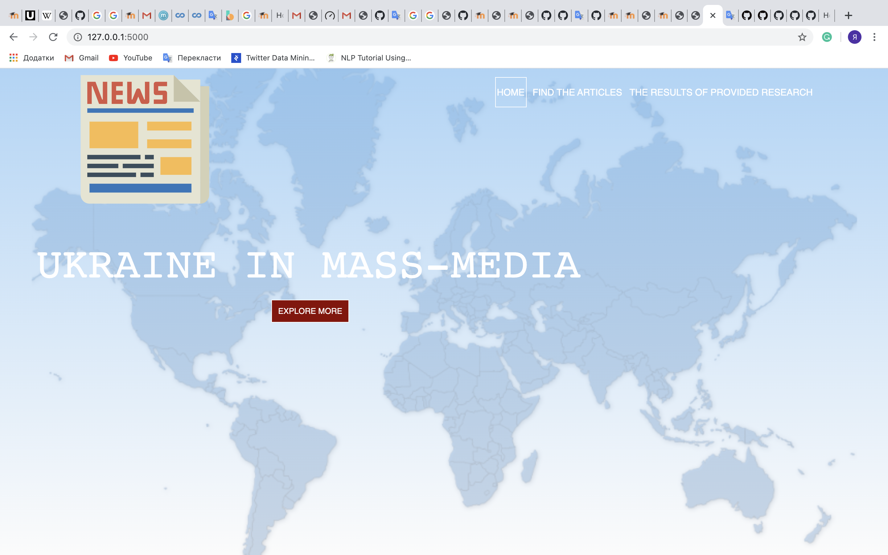

# Analysis of international publication about Ukraine
## Description:

Without any doubts, mass media play a huge role in our everyday life. In the modern world, where the quality of information technology and its use increasingly determine the nature of society, the question about how the media shape public opinion is really very important. Our team understands that the flow information in the 21 century is so diverse and contradictory that it is very difficult for an ordinary person to understand it on their own, which can often lead to misinformation and falling under the influence of propaganda. Information has influence on the way we think and act, so we thought it would be interesting and useful to make a research about articles in mass media throughout the world about Ukraine.

What news sources has published the biggest number of articles about Ukraine? What word the Western mass media has used the most when speaking about Ukraine?

## Input and Output data:

Input:

No input needed

Output:

Web-page, where user can find a lot of useful stuff and search for the articles

## The structure of the program:

Root:

-mass-media[Directory on a main page]

  -flask[Directory]
  
    --our_flask_app.py
    
      Our main file that makes web-representation for our project
    
    --response_handler.py
    
    --search.csv
    
    --news.db
    
    --static
    
    --templates
    
  -ADT[Directory]
  
    --ADT.py
    
      abstact data type we created by ourselves
      
    --Abstract Class.py
    
      module to structure our info using our abstract data type
      
    --gb .json
    
      json file for example
      
  -News_by_API[Directory]
  
    --collect_data.py
    
      module to collect our data
    
    --countries.txt
    
      txt file with all the countries in our research
    
    --credentials.json
    
      credentials for News API
    
  -ORM Database[Directory]
  
    --json_handler.py
    
    --news.db
    
      database
    
    --orm_data.py
    
    --Responses_sorted_by_countries
    
      News articles collected for a month sorted by countries of publication
    
  -Research[Directory]
  
    --date.png
    
      chart
    
    --frequency.png
    
      chart
    
    --news.db
    
      database
    
    --source_frequency.py
    
      module to search for the news sources that more than other write about Ukraine and create a chart
    
    --time_frequency.py
    
      module to explore on which day there was the biggest number of articles about Ukraine and create a chart
    
    --top_used_words.py
    
      module to search for most used words and create a chart
    
    --words.png
    
      chart

So does our web-representation looks like:

You can search for the articles pressing "Find the articles button", explore more about our small project by pressing "Explore more" or look for some visual representation by pressing "The results of provided research". Enjoy it!

## Credits:

* Khrystyna Sliusarchuk
* Yarema Fylypchuk
* Oleksa Hryniv
